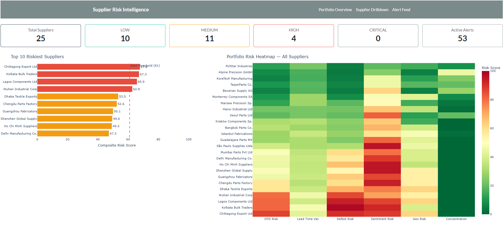
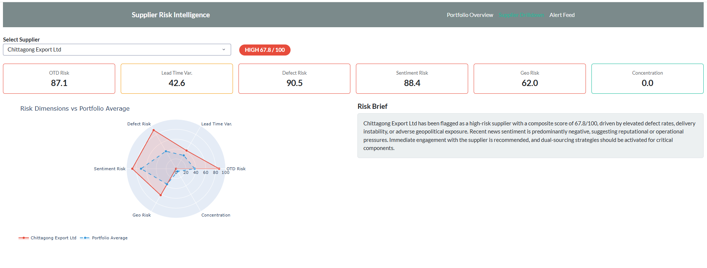
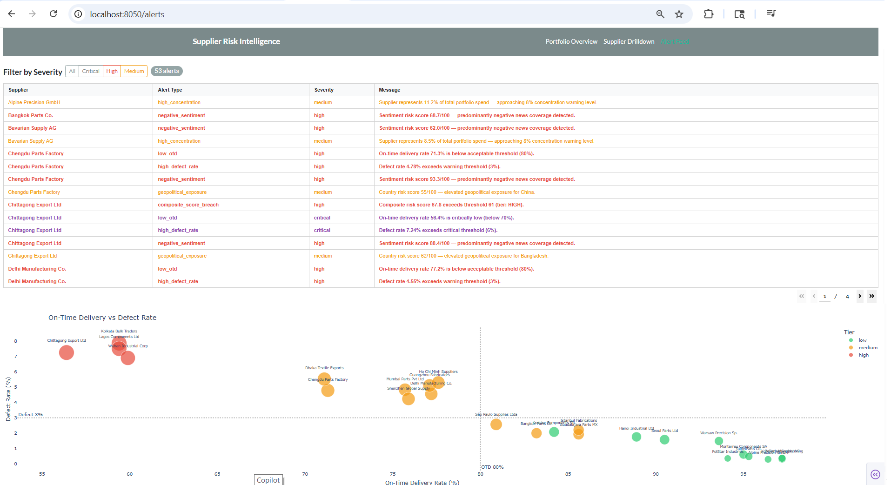
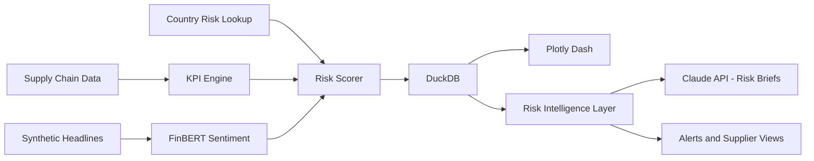

# Supplier Risk Intelligence Platform

> End-to-end AI platform for supplier risk intelligence — combining KPI analytics, NLP sentiment (FinBERT), and LLM-generated procurement insights.


---

## What It Does

The Supplier Risk Intelligence Platform ingests supplier transaction data and automatically scores each supplier across six risk dimensions: on-time delivery, lead time variability, defect rate, news sentiment, geopolitical exposure, and order concentration.

It produces a composite 0–100 risk index with tier classification (**LOW / MEDIUM / HIGH / CRITICAL**). A FinBERT NLP pipeline evaluates synthetic supplier news headlines to capture reputational and operational sentiment signals independently from structured KPIs.

The Claude API then generates a professional three-to-four-sentence risk brief for each supplier, mirroring the type of output a senior procurement analyst might produce after reviewing all available signals.

A three-page Plotly Dash dashboard surfaces the full risk picture through a portfolio heatmap, per-supplier drilldown views with radar charts, and a live alert feed with severity classification.

---
## Business Impact

This platform enables procurement teams to:

- Detect high-risk suppliers earlier using multi-signal scoring
- Reduce supply disruption exposure through proactive alerts
- Replace manual supplier reviews with automated AI-generated insights
- Prioritise mitigation actions based on quantified risk tiers
- Scale supplier monitoring across large portfolios with minimal analyst effort

➡️ Designed to replicate and augment the decision-making process of a senior procurement analyst.

---
## Key Features

- Multi-dimensional supplier risk scoring (6 dimensions)
- FinBERT-based financial sentiment analysis
- LLM-generated procurement risk narratives
- Real-time alert engine with severity classification
- Interactive multi-page dashboard (Plotly Dash)
- Modular pipeline architecture (ingestion → scoring → intelligence → UI)

---
## Demo

### Portfolio Overview
End-to-end view of supplier risk across the portfolio, including KPI distribution, risk tiers, and multi-dimensional heatmap.



---

### Supplier Drilldown
Detailed supplier-level analysis combining KPI breakdown, radar comparison, and AI-generated risk narrative.



---

### Alert Feed
Real-time alert engine highlighting high-risk suppliers with severity classification and actionable insights.




---

## System Architecture


---

## Risk Scoring Model

| Dimension | Weight | Source | Description |
|---|---:|---|---|
| On-time delivery risk | 25% | Transaction data | Percentage of orders delivered late |
| Lead time variability | 20% | Transaction data | Coefficient of variation in delivery lead times |
| Defect / quality risk | 20% | Transaction data | Defective units as a share of total units ordered |
| News sentiment risk | 15% | FinBERT NLP | Negative sentiment score across supplier headlines |
| Geopolitical risk | 10% | Country risk lookup | Country-level risk score based on World Bank governance indicators |
| Concentration risk | 10% | Transaction data | Supplier share of total portfolio spend |

### Tier Classification

| Score Range | Tier | Recommended Action |
|---|---|---|
| 0–30 | LOW | Monitor quarterly |
| 31–60 | MEDIUM | Monitor monthly |
| 61–80 | HIGH | Implement a corrective action plan |
| 81–100 | CRITICAL | Escalate immediately |

---

## Tech Stack

| Component | Technology | Purpose |
|---|---|---|
| Data generation | Python · Faker | Synthetic supply chain transaction generation |
| KPI computation | Pandas · NumPy | Supplier-level KPI aggregation and performance analysis |
| Sentiment NLP | FinBERT (ProsusAI) · Hugging Face Transformers | Finance-domain headline sentiment scoring |
| LLM briefs | Anthropic Claude API | Narrative supplier risk assessment |
| Database | DuckDB | Zero-server analytical storage and querying |
| Dashboard | Plotly Dash · Dash Bootstrap Components | Interactive multi-page supplier risk dashboard |
| Validation | Pydantic | Typed schema validation across the pipeline |
| Testing | pytest | Unit tests for the KPI engine, risk scorer, and alert engine |
| Notebooks / Analysis | Jupyter · Matplotlib · Seaborn | Exploration, evaluation, and visual analysis |

---

## Dataset

The supply chain transaction dataset is **synthetically generated** and includes **5,000 orders**, **25 suppliers**, **12 countries**, and **3 years of activity (2022–2024)**.

Synthetic generation was chosen deliberately to introduce meaningful variation across suppliers, including realistic defect rates (**0.2% to 8%**), a broad delivery performance spread (**~17-day gap** between the best and worst suppliers), and tier-diverse supplier profiles that create a representative portfolio for dashboard demonstration.

Country risk scores are derived from **World Bank governance indicators** and mapped to a **0–100 scale**.

Supplier news headlines are generated using tier-weighted templates and scored with **FinBERT**, a finance-domain BERT model that responds to headline language rather than supplier identity, allowing the platform to capture an independent sentiment signal.

> Note: Synthetic data is used for demonstration purposes only. The architecture is designed to operate on real ERP / procurement datasets with minimal adaptation.

---

## Project Structure

```text
supplier-risk-intelligence/
│
├── config.py                          # Risk weights, thresholds, model config
├── requirements.txt
├── .env                               # ANTHROPIC_API_KEY (gitignored)
├── .gitignore
│
├── data/
│   ├── raw/
│   │   ├── supply_chain.csv           # Generated: 5,000 orders, 25 suppliers
│   │   └── country_risk.csv           # Country risk lookup table
│   └── processed/                     # Generated by pipeline (gitignored)
│       ├── supplier_kpis.csv
│       ├── sentiment_scores.csv
│       ├── supplier_headlines.csv
│       ├── risk_scores.csv
│       ├── supplier_briefs.csv
│       ├── supplier_alerts.csv
│       └── supplier_risk.duckdb
│
├── ingestion/
│   ├── sc_loader.py                   # Loads and cleans supply chain CSV
│   └── country_risk_loader.py         # Loads country risk lookup
│
├── features/
│   ├── kpi_engine.py                  # Computes six KPI dimensions per supplier
│   ├── sentiment_engine.py            # FinBERT scoring pipeline
│   ├── news_generator.py              # Tier-weighted synthetic headline generation
│   ├── risk_scorer.py                 # Weighted composite score and tier assignment
│   └── run_sentiment.py               # Standalone sentiment pipeline script
│
├── intelligence/
│   ├── brief_generator.py             # Claude API risk narrative generation
│   ├── mock_brief_generator.py        # Four-tier mock brief templates
│   └── alert_engine.py                # Threshold-based alert rule engine
│
├── database/
│   ├── schema.py                      # Pydantic models for core data structures
│   └── db_writer.py                   # DuckDB persistence layer
│
├── dashboard/
│   ├── app.py                         # Plotly Dash entry point (port 8050)
│   └── pages/
│       ├── overview.py                # Portfolio heatmap and summary metrics
│       ├── supplier.py                # Supplier drilldown and AI brief
│       └── alerts.py                  # Alert feed and risk scatter plots
│
├── scripts/
│   ├── generate_supply_chain_data.py  # Creates data/raw/supply_chain.csv
│   ├── generate_country_risk.py       # Creates data/raw/country_risk.csv
│   ├── run_pipeline.py                # End-to-end: ingest → score → persist
│   └── run_intelligence.py            # Brief and alert generation
│
├── notebooks/
│   └── risk_score_analysis.ipynb      # Evaluation: distributions and correlations
│
└── tests/
    ├── test_kpi_engine.py
    ├── test_risk_scorer.py
    └── test_alert_engine.py
```

---

## Setup

### Prerequisites

- Python 3.10+
- Node.js (optional, for Claude Code workflows)
- Anthropic API key (for live brief generation)

### Installation
```bash
# 1. Clone the repository
git clone https://github.com/victorgvc-hes/supplier-risk-intelligence.git
cd supplier-risk-intelligence

# 2. Create and activate a virtual environment
python -m venv .venv

# On macOS / Linux
source .venv/bin/activate

# On Windows
.venv\Scripts\activate

# 3. Install dependencies
pip install -r requirements.txt

# 4. Add your Anthropic API key
# macOS / Linux
echo "ANTHROPIC_API_KEY=your-key-here" > .env

# Windows (PowerShell)
echo ANTHROPIC_API_KEY=your-key-here > .env
```

### Running the pipeline
```bash
# 1. Generate synthetic supply chain data
python scripts/generate_supply_chain_data.py

# 2. Generate country risk lookup
python scripts/generate_country_risk.py

# 3. Run KPI computation and risk scoring
python scripts/run_pipeline.py

# 4. Run FinBERT sentiment analysis
python features/run_sentiment.py

# 5. Generate risk briefs and alerts
python scripts/run_intelligence.py

# 6. Launch the dashboard
python dashboard/app.py
# Open http://localhost:8050
```

### Running Tests
```bash
pytest tests/ -v
```

---

## Switching to Live Mode

By default, the project uses mock-generated supplier briefs to support safe and cost-free development.

To enable live LLM-generated briefs, update the following setting in config.py:

In `config.py`, change:
```python
USE_MOCK_BRIEF = True   # → change to False
```

Then re-run `scripts/run_intelligence.py`. The Claude API 
will generate real risk briefs for all 25 suppliers using 
your `ANTHROPIC_API_KEY`. Each brief cites specific KPI 
values and recommends a concrete procurement action.

**Estimated API cost:** approximately **$0.10–$0.20** for all 25 suppliers, depending on the Claude model and prompt length used.

---

## Dashboard Pages

| Page | URL | Description |
|---|---|---|
| Portfolio Overview | `localhost:8050/` | Portfolio risk heatmap, top-10 supplier bar chart, and radar summary |
| Supplier Drilldown | `localhost:8050/supplier` | Six-dimension risk cards, radar comparison, and AI-generated brief |
| Alert Feed | `localhost:8050/alerts` | Severity-filtered alerts and on-time-delivery vs defect-rate scatter plot |

---

## Future Improvements

- Integration with real-time ERP systems (SAP, Oracle)
- Streaming pipeline for continuous risk updates
- Advanced anomaly detection using ML models
- Supplier network graph analysis
- Integration with external risk data providers (e.g., Dun & Bradstreet)

---

## Portfolio Notes

This project demonstrates multi-source signal fusion for procurement risk intelligence by combining structured operational KPIs with unstructured NLP signals from a finance-domain transformer model (FinBERT), and then synthesizing both into narrative output through the Claude API.

The LLM-as-analyst pattern — where structured tabular data is transformed into professional prose recommendations — is directly applicable to enterprise procurement, supplier management, and supply chain risk platforms.

The codebase follows production-grade design patterns throughout, including typed Pydantic schemas, idempotent pipeline steps, a mock/live toggle for cost-free development, DuckDB for zero-infrastructure analytics, and a modular architecture in which each layer — ingestion, features, intelligence, and dashboard — can be developed and tested independently.

---

## Author

**Victor Vergara**

Procurement and operations professional with 20+ years of experience in supply chain, analytics, and process improvement. Focused on applying AI/ML, forecasting, and digital transformation to real-world operational challenges.

- LinkedIn: https://www.linkedin.com/in/victor-vergara075/
- Email: victorgvc@gmail.com
- Portfolio: https://github.com/victorgvc-hes?tab=repositories

---